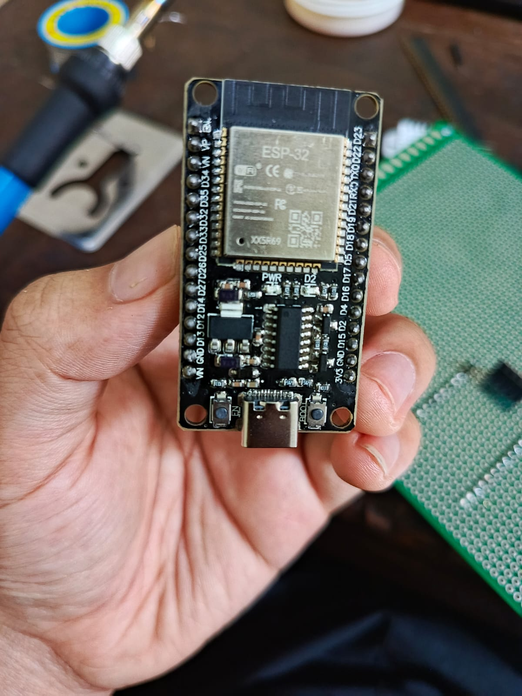
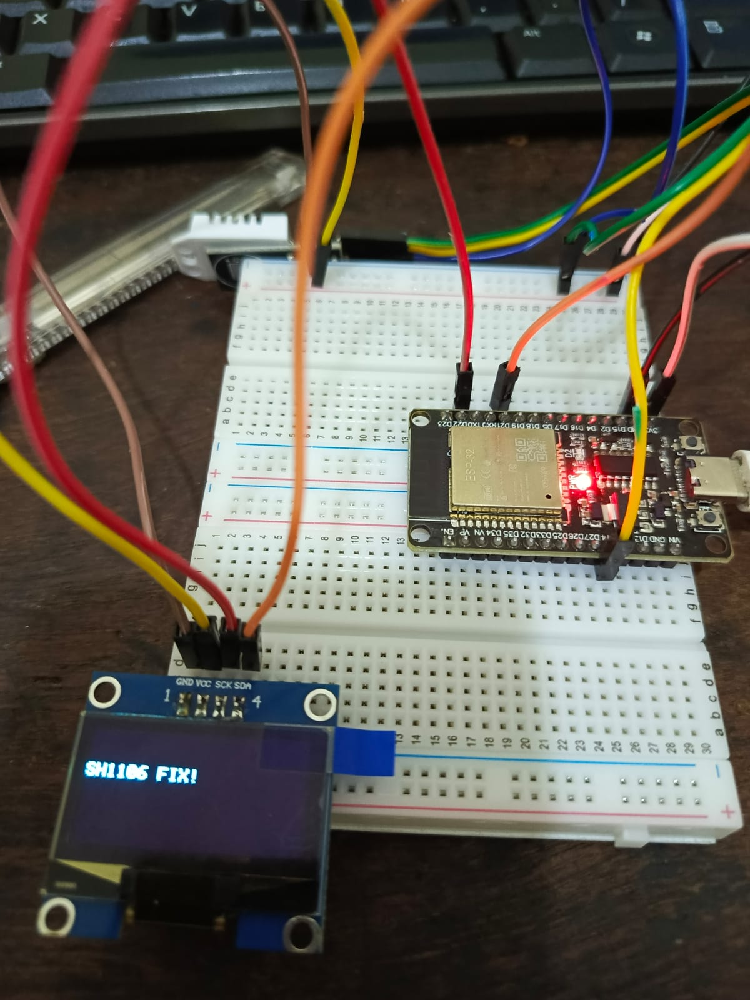
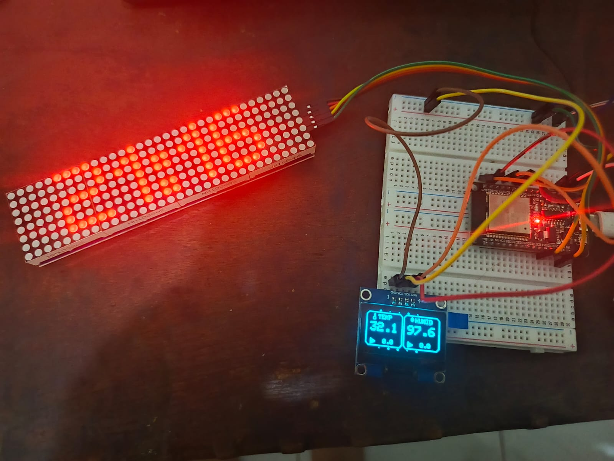
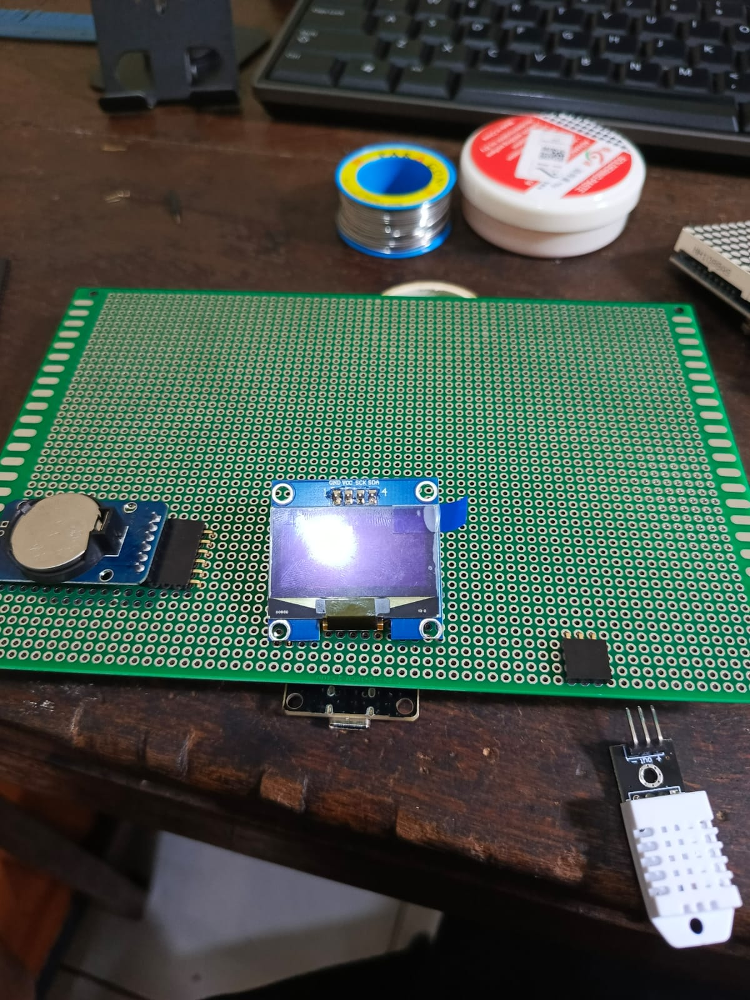

# DisplayDashboard: ESP32 Smart Clock with Environmental Monitoring


*Dual-display system: MAX7219 Dot Matrix (time) + SH1106 OLED (temp/humidity)*

---

## Why This Project Exists

This is a **personal fun project** to learn microcontroller fundamentals through real implementation:
- Display **real-time clock** synchronized via NTP
- Monitor **temperature & humidity** with trend indicators
- Practice **non-blocking code architecture** and modular design
- Learn **I2C/SPI communication** and multi-peripheral management
- **Not a competition project**, just pure learning by building

---

## Key Features

### Display System
- **Dot Matrix (MAX7219)**: Large clock display with colon blink animation
- **OLED (SH1106)**: Shows temperature, humidity, and trend indicators with breathing animation
- **Sync Status LED**: Single pixel on dot matrix shows if last NTP sync failed

### Timekeeping
- **NTP Sync**: Auto-sync every hour when WiFi available
- **RTC DS3231 Backup**: Keeps time running offline with coin battery (CR2032)
- **Failsafe Logic**: Falls back to RTC if WiFi fails, shows warning on display
- **Timezone Support**: Configurable GMT offset (default: GMT+7 for Jakarta)

### Environmental Monitoring
- **DHT22 Sensor**: Reads temperature and humidity every 10 seconds
- **Trend Detection**: Arrows (▲/▼/▶) show if values are rising/falling/stable
- **Update Interval**: Trend recalculated every 30 seconds based on historical data
- **Error Handling**: Gracefully handles DHT22 NaN readings

### User Interaction
- **Touch Sensor (GPIO 4)**: Wake OLED display, toggle inverted mode
- **Manual Sync**: Hold touch >2 seconds to force NTP sync immediately
- **Auto Sleep**: OLED turns off after 10 seconds of inactivity to save power
- **Interactive Feedback**: Display shows "SYNCING..." and success/failure messages

---

## 🔧 Hardware Architecture

### Component List

| Component | Model | Quantity | Purpose |
|-----------|-------|----------|---------|
| Microcontroller | ESP32 DevKit V1 | 1 | Main controller with WiFi |
| Dot Matrix Display | MAX7219 8x8 LED (4-in-1) | 1 | Large time display |
| OLED Display | SH1106 128x64 I2C 1.3 inch | 1 | Sensor data & UI |
| RTC Module | DS3231 with battery | 1 | Backup timekeeping |
| Temp/Humidity Sensor | DHT22 (AM2302) | 1 | Environmental monitoring |
| Touch Sensor | Bare jumper wire | 1 | Capacitive touch input |
| Power Supply | 5V 2A USB adapter | 1 | Powers entire system |

### Pinout Diagram

| Component | Interface | ESP32 GPIO | Power | Notes |
|-----------|-----------|------------|-------|-------|
| Dot Matrix MAX7219 | SPI | DIN:23, CLK:18, CS:5 | 5V (VIN) | Uses hardware SPI (VSPI) |
| OLED SH1106 | I2C | SDA:21, SCL:22 | 3.3V | **⚠️ NEVER use 5V** |
| RTC DS3231 | I2C | SDA:21, SCL:22 | 3.3V | Shares I2C bus with OLED |
| DHT22 Sensor | Digital (1-Wire) | Data:14 | 3.3V | Built-in pull-up resistor |
| Touch Sensor | Capacitive | GPIO 4 | - | Bare wire acts as touch pad |

### Wiring Diagram

```
[Placeholder: Add Fritzing diagram here]
```


### Power Distribution

- **5V Rail**: MAX7219 (connects to ESP32 VIN from USB)
- **3.3V Rail**: OLED, RTC, DHT22 (from ESP32 3.3V regulator)
- **Current Draw**: ~350mA typical, ~500mA peak (when WiFi syncing)

---

## 🧠 Software Architecture

### Project Structure

```
CekBoard/
├── platformio.ini            # PlatformIO configuration
├── src/
│   ├── main.cpp              # Main loop & hardware initialization
│   ├── main1.cpp.bak         # Backup of previous version
│   └── include/
│       ├── Timer.h           # Non-blocking timer class
│       ├── DisplayManager.h  # OLED/Matrix rendering functions
│       ├── LogicManager.h    # WiFi, NTP, RTC sync logic
│       └── DebugMacros.h     # Conditional serial debug macros
└── docs/                     # Documentation and images
```

### Key Design Patterns

#### 1. Non-Blocking Execution
```cpp
// Uses Timer class instead of delay()
Timer displayTimer(10000);  // 10 second timer

void loop() {
  if (displayTimer.isReady()) {
    updateDisplay();
    displayTimer.reset();
  }
}
```

#### 2. Modular Rendering
All drawing functions isolated in `DisplayManager.h`:
- `renderOLED()` - Main OLED update function
- `drawClockToMatrix()` - Dot matrix time display
- `breathingAnimation()` - Smooth fade in/out effect

#### 3. Conditional Debug Output
```cpp
// DebugMacros.h allows toggle debug with one flag
#define DEBUG_MODE 1

#if DEBUG_MODE
  #define DEBUG_PRINT(x) Serial.print(x)
#else
  #define DEBUG_PRINT(x)
#endif
```

### Main Loop Flow

```
loop() {
  ├─ [Every scan] Read touch sensor state (GPIO 4)
  │   ├─ Short press: Wake OLED / Toggle invert mode
  │   └─ Long press (>2s): Force NTP sync
  │
  ├─ [Every 10s] Update DHT22 sensor data
  │   ├─ Read temperature & humidity
  │   ├─ Store in history array for trend calculation
  │   └─ Handle NaN errors gracefully
  │
  ├─ [Every 30s] Calculate trend indicators
  │   ├─ Compare current vs 30s ago
  │   └─ Set arrow symbols (▲/▼/▶)
  │
  ├─ [Every 100ms] Refresh OLED animation
  │   ├─ Update breathing effect brightness
  │   ├─ Draw sensor values with trend arrows
  │   └─ Show sync status messages
  │
  ├─ [Every 1s] Update dot matrix clock display
  │   ├─ Blink colon separator
  │   ├─ Show sync fail indicator if needed
  │   └─ Render HH:MM format
  │
  ├─ [Every 60 min] Sync NTP to RTC
  │   ├─ Connect to WiFi
  │   ├─ Query NTP server (pool.ntp.org)
  │   ├─ Update RTC DS3231
  │   └─ Disconnect WiFi to save power
  │
  └─ [Every 10s idle] Auto-sleep OLED display
      └─ Turn off OLED, keep dot matrix active
```

### State Machine Diagram

```
[Placeholder: Add state diagram for touch interaction & sync logic]
```


---

## 🛠️ How to Build

### Prerequisites

#### Hardware
- ESP32 DevKit V1 board
- USB cable (data + power capable)
- Breadboard and jumper wires
- All components from hardware list above

#### Software
- [Visual Studio Code](https://code.visualstudio.com/)
- [PlatformIO IDE extension](https://platformio.org/install/ide?install=vscode)
- Git (for cloning repository)

#### Required Libraries
These will auto-install via PlatformIO:
- `Adafruit GFX Library` - Graphics primitives
- `Adafruit SH110X` - OLED driver
- `DHT sensor library` - Temperature/humidity sensor
- `MD_Parola` & `MD_MAX72xx` - Dot matrix control
- `RTClib` - DS3231 RTC communication
- `NTPClient` - Network Time Protocol

### First Boot Checklist

- [ ] Dot matrix shows `--:--` initially
- [ ] Serial monitor shows WiFi connection attempt
- [ ] After NTP sync, clock shows correct time
- [ ] OLED displays temperature/humidity readings
- [ ] Touch sensor wakes OLED when tapped
- [ ] RTC keeps time after WiFi disconnects

---

## Known Issues & Limitations

### Current Issues

1. **WiFi Sync Blocking**: NTP sync blocks main loop for ~5 seconds
   - **Impact**: Display freezes briefly during hourly sync
   - **Workaround**: Acceptable for 1-hour interval, will refactor to async

2. **DHT22 First Read Error**: Sensor returns NaN on first boot
   - **Impact**: Shows `--.-°C` for first 10 seconds
   - **Solution**: Code handles gracefully, self-corrects on next read

3. **Touch Sensitivity Varies**: Depends on wire length and body capacitance
   - **Impact**: May need multiple taps in dry conditions
   - **Solution**: Adjust threshold in code or use copper tape pad

4. **I2C Bus Glitch on Power Spike**: Rare OLED freeze if USB power fluctuates
   - **Impact**: Requires reset button press
   - **Mitigation**: Use quality 5V 2A power supply

### Design Limitations

- **No Battery Backup**: Main system requires USB power (only RTC has battery)
- **Single Timezone**: No automatic DST or multi-timezone support
- **Fixed Display Layout**: Sensor data positions hardcoded (no UI config)
- **WiFi Only**: No Ethernet or LoRa connectivity options

---

## 🚀 Future Improvements

---

## 📸 Gallery







*Testing I2C communication with OLED and RTC*


---


<div align="center">

**⭐ Star this repo if you found it useful!**

Made with ☕ and lots of debugging

</div>